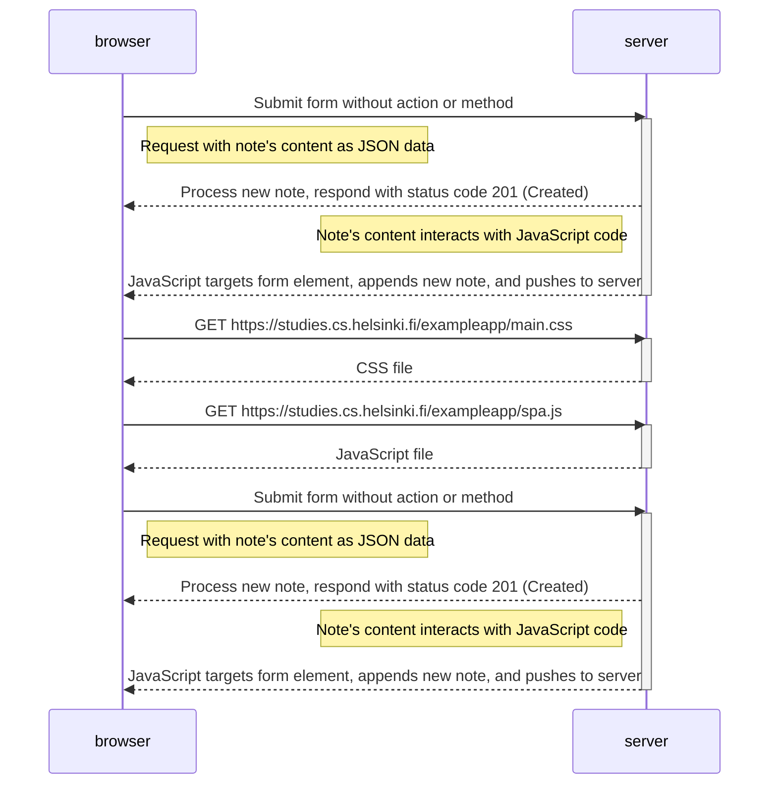

Exercise 0.6

```mermaid
sequenceDiagram
    participant browser
    participant server

    browser->>server: Submit form without action or method
    activate server
    note right of browser: Request with note's content as JSON data
    server-->>browser: Process new note, respond with status code 201 (Created)
    note left of server: Note's content interacts with JavaScript code
    server-->>browser: JavaScript targets form element, appends new note, and pushes to server
    deactivate server

    browser->>server: GET https://studies.cs.helsinki.fi/exampleapp/main.css
    activate server
    server-->>browser: CSS file
    deactivate server

    browser->>server: GET https://studies.cs.helsinki.fi/exampleapp/spa.js
    activate server
    server-->>browser: JavaScript file
    deactivate server

    browser->>server: Submit form without action or method
    activate server
    note right of browser: Request with note's content as JSON data
    server-->>browser: Process new note, respond with status code 201 (Created)
    note left of server: Note's content interacts with JavaScript code
    server-->>browser: JavaScript targets form element, appends new note, and pushes to server
    deactivate server

```