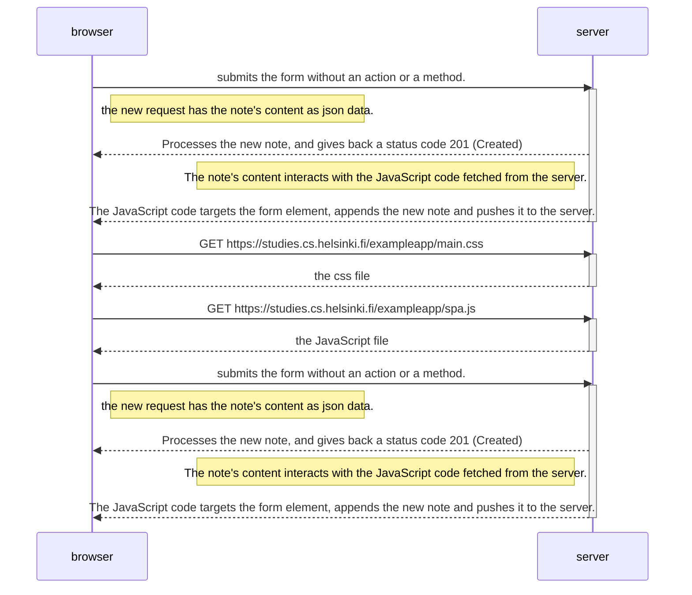

Exercise 0.6

```mermaid
sequenceDiagram
    participant browser
    participant server

    browser->>server: submits the form without an action or a method.
    activate server
    note right of browser: the new request has the note's content as json data.
    server-->>browser: Processes the new note, and gives back a status code 201 (Created)
    note left of server: The note's content interacts with the JavaScript code fetched from the server.
    server-->>browser: The JavaScript code targets the form element, appends the new note and pushes it to the server.
    deactivate server
    browser->>server: GET https://studies.cs.helsinki.fi/exampleapp/main.css
    activate server
    server-->>browser: the css file
    deactivate server

    browser->>server: GET https://studies.cs.helsinki.fi/exampleapp/spa.js
    activate server
    server-->>browser: the JavaScript file
    deactivate server

    browser->>server: submits the form without an action or a method.
    activate server
    note right of browser: the new request has the note's content as json data.
    server-->>browser: Processes the new note, and gives back a status code 201 (Created)
    note left of server: The note's content interacts with the JavaScript code fetched from the server.
    server-->>browser: The JavaScript code targets the form element, appends the new note and pushes it to the server.
    deactivate server
```